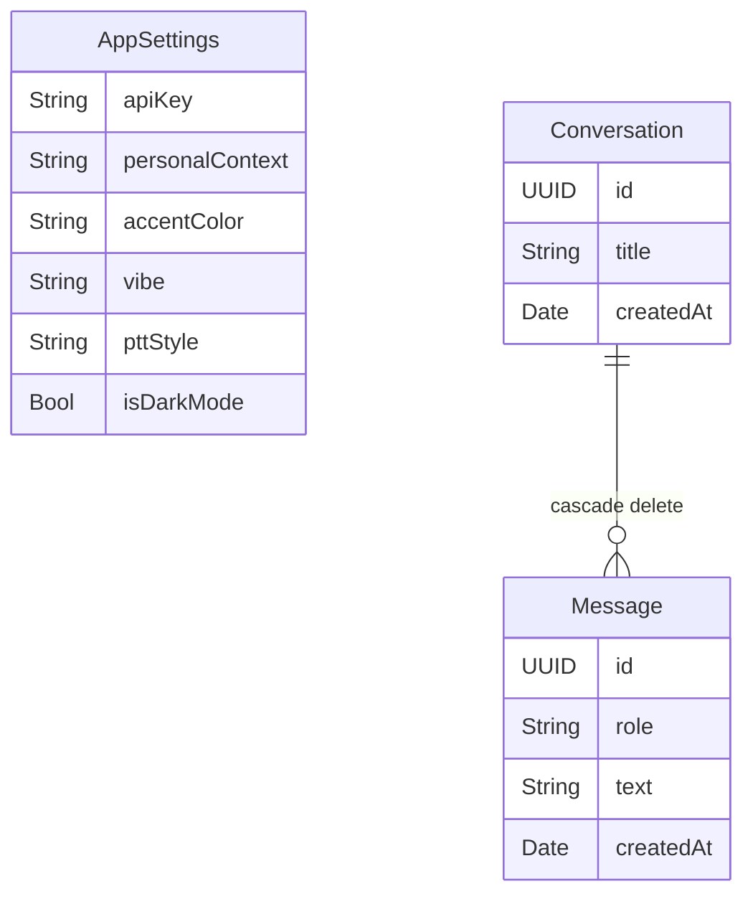
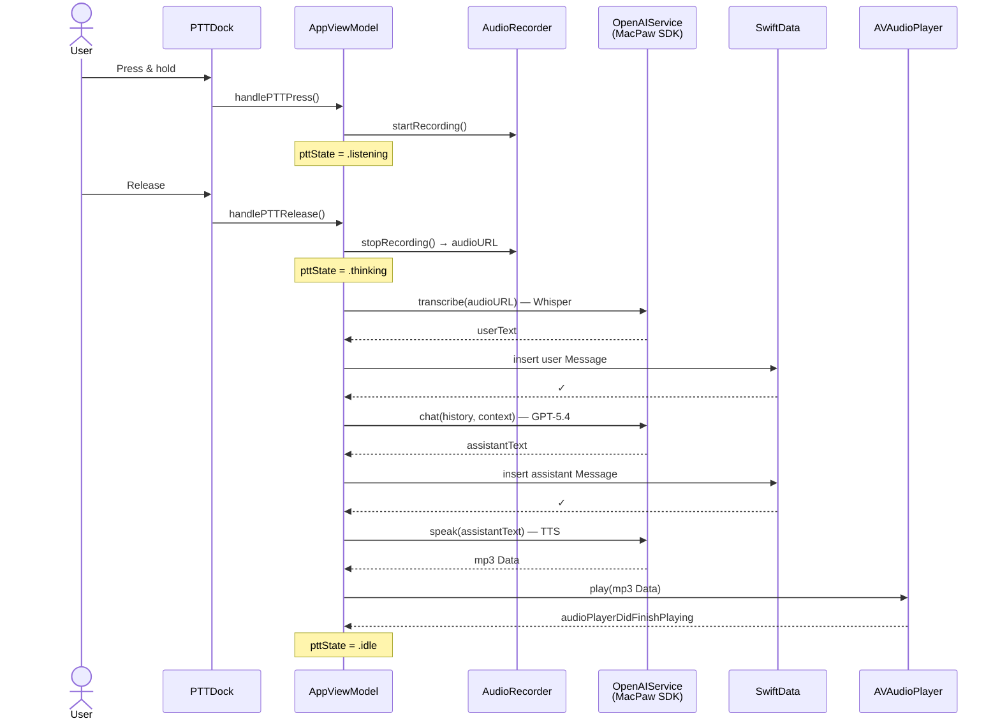
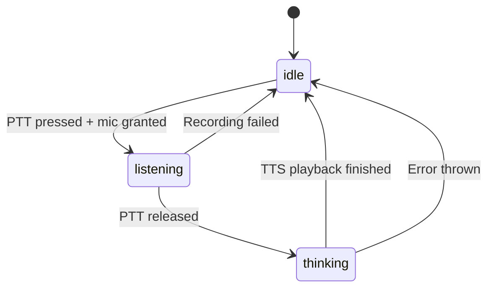

# VoiceGPT

A voice-first AI chat app for iOS 26, built with SwiftUI and SwiftData. Hold the push-to-talk button to speak, and VoiceGPT will transcribe your voice via Whisper, generate a reply with GPT-5.4, and speak it back using OpenAI TTS — all stored locally with no iCloud sync.

## Features

- **Push-to-talk voice input** — hold to record, release to send
- **OpenAI Whisper** transcription (speech → text)
- **GPT-5.4** chat with personal context support
- **OpenAI TTS** audio playback (text → speech)
- **Conversation history** in a slide-in pane, persisted locally
- **Liquid Glass design** — iOS 26 materials, radial gradient wallpapers, breathing animations
- **Themeable** — 4 accent colors, 3 background vibes, 3 PTT button styles
- **Zero iCloud sync** — API key and all data stored on-device only via SwiftData

---

## Requirements

| Requirement | Version |
|---|---|
| iOS | 26.0+ |
| Xcode | 26.0+ |
| Swift | 5.0+ |
| OpenAI API Key | Required at runtime |

---

## Architecture

### App Structure

```mermaid
graph TD
    App[VoiceGPTApp<br/>ModelContainer setup] --> CV[ContentView<br/>Splash → Main router]

    CV -->|isReady = false| SP[SplashView<br/>Animated logo + progress]
    CV -->|isReady = true| MV[MainView<br/>Root screen]

    MV --> WP[WallpaperView<br/>Radial gradient background]
    MV --> TB[Top Bar<br/>Menu + title]
    MV --> TX[Transcript ScrollView]
    MV --> PTT[PTTDock<br/>Ring / Orb / Wave styles]
    MV --> HP[HistoryPane<br/>Left slide-in overlay]
    MV --> SS[SettingsSheet<br/>Bottom modal]

    TX --> MB[MessageBubbleView<br/>User & assistant bubbles]
    TX --> TI[ThinkingIndicator<br/>Pulsing dots]

    MV --> VM[AppViewModel<br/>@Observable state + logic]

    VM --> AR[AudioRecorder<br/>AVAudioRecorder wrapper]
    VM --> OA[OpenAIService<br/>Whisper + GPT + TTS]
    VM --> AP[AVAudioPlayer<br/>TTS playback]

    SS -.->|@Bindable| AS[(AppSettings<br/>SwiftData)]
    HP -.->|@Query| CO[(Conversation<br/>SwiftData)]
    TX -.->|sorted| ME[(Message<br/>SwiftData)]
```

### Data Model



All three models are stored in a local SwiftData container with `cloudKitDatabase: .none` — no iCloud sync, ever.

### PTT Interaction Flow



### PTT State Machine



---

## Project Structure

```
VoiceGPT/
├── VoiceGPT/                    # App source (PBXFileSystemSynchronizedRootGroup)
│   ├── VoiceGPTApp.swift        # @main — ModelContainer, cloudKitDatabase: .none
│   └── ContentView.swift        # Splash → Main router
├── Models/
│   ├── AppSettings.swift        # SwiftData model: API key, theme prefs
│   ├── Conversation.swift       # SwiftData model: title, createdAt, messages[]
│   └── Message.swift            # SwiftData model: role, text, createdAt
├── Services/
│   ├── AudioRecorder.swift      # AVAudioRecorder wrapper (@Observable)
│   └── OpenAIService.swift      # Whisper + GPT-5.4 + TTS via MacPaw SDK
├── ViewModels/
│   └── AppViewModel.swift       # PTT state machine, conversation orchestration
├── Views/
│   ├── DesignSystem.swift       # Color tokens, animation constants, glass helpers
│   ├── WallpaperView.swift      # Radial gradient backgrounds (calm/vibrant/moody)
│   ├── SplashView.swift         # Soundwave logo + loading bar
│   ├── MainView.swift           # Root screen: wallpaper + topbar + transcript + PTT
│   ├── PTTDock.swift            # Ring / Orb / Wave push-to-talk buttons
│   ├── MessageBubbleView.swift  # Chat bubbles + thinking indicator
│   ├── HistoryPane.swift        # Left-slide conversation history
│   └── SettingsSheet.swift      # Bottom modal: API key, context, appearance
├── VoiceGPTTests/
└── VoiceGPTUITests/
```

---

## Setup

1. **Clone the repo**
   ```bash
   git clone https://github.com/luisaugusto/VoiceGPT.git
   cd VoiceGPT
   ```

2. **Open in Xcode 26**
   ```bash
   open VoiceGPT.xcodeproj
   ```
   Swift Package Manager will resolve the [MacPaw/OpenAI](https://github.com/MacPaw/OpenAI) dependency automatically.

3. **Run on a simulator or device** — no configuration needed to build.

4. **Add your OpenAI API key** — tap the hamburger menu → gear icon → paste your key. It is stored in SwiftData on-device only.

---

## Dependencies

| Package | Purpose |
|---|---|
| [MacPaw/OpenAI](https://github.com/MacPaw/OpenAI) | Whisper transcription, GPT chat, TTS |

---

## GitHub Actions

Three workflows run on every push and pull request to `main`:

| Workflow | What it checks |
|---|---|
| **Build** | `xcodebuild` succeeds with no errors |
| **Lint** | No compiler warnings (`SWIFT_TREAT_WARNINGS_AS_ERRORS=YES`) |
| **Test** | Unit and UI test suites pass |

> **Note:** Workflows require a macOS runner with **Xcode 26** installed. Update `env.XCODE_PATH` in each workflow file if your runner uses a different path.
