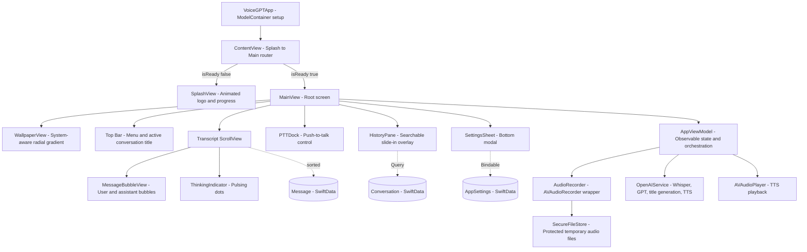
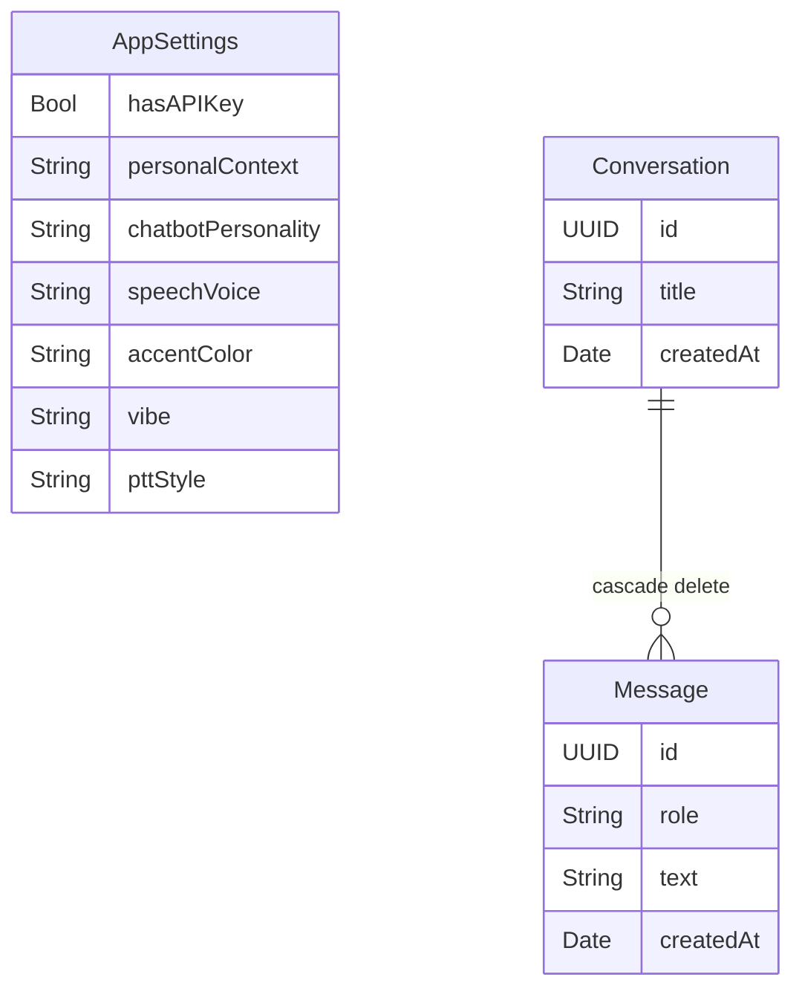
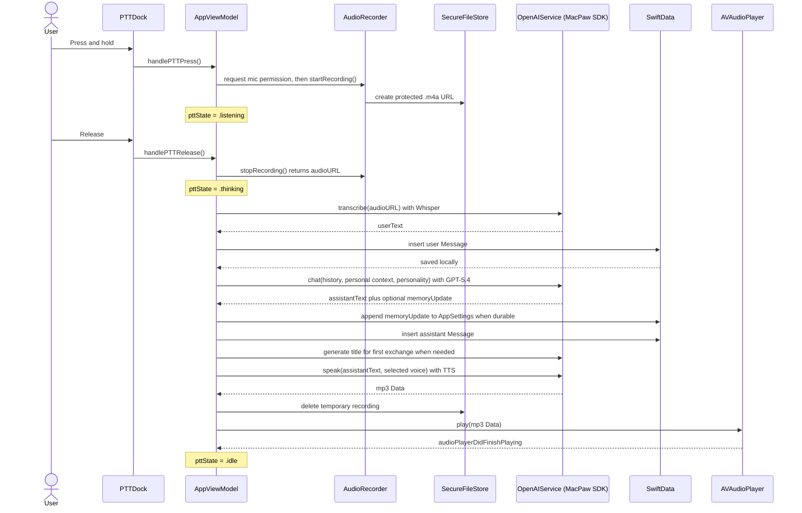
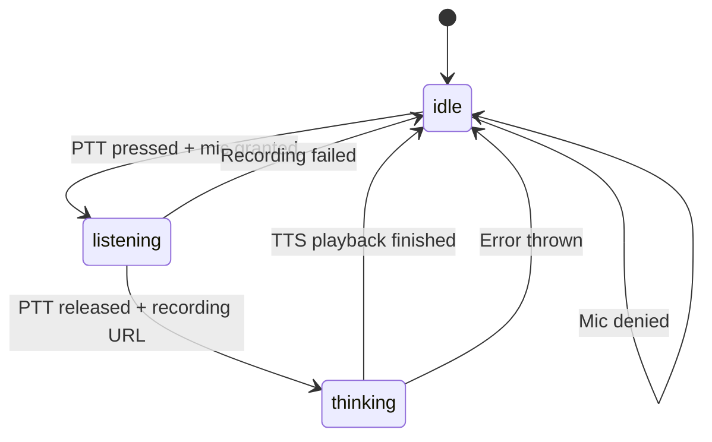

# VoiceGPT

A voice-first AI chat app for iOS 26, built with SwiftUI and SwiftData. Hold the push-to-talk button to speak, and VoiceGPT will transcribe your voice with Whisper, generate a reply with GPT-5.4, speak it back with OpenAI TTS, and keep your conversations local with no iCloud sync.

## Features

- **Push-to-talk voice input** — hold to record, release to send, with microphone permission handling
- **OpenAI Whisper** transcription (speech → text)
- **GPT-5.4** chat with persistent personal context and optional chatbot personality instructions
- **Automatic memory capture** — durable preferences and details can be appended to personal context after a chat response
- **OpenAI TTS** playback with a selectable assistant voice
- **Conversation history** — slide-in pane with search, generated conversation titles, previews, and deletion flow
- **Liquid Glass design** — iOS 26 materials, radial gradient wallpaper, breathing animations, and system-driven light/dark appearance
- **Local-first privacy posture** — API key stored in the iOS Keychain, temporary recordings stored under complete file protection and cleaned up after transcription, and conversations/preferences stored on-device only via SwiftData

---

## Requirements

| Requirement | Version |
|---|---|
| iOS | 26.0+ |
| Xcode | 26.0+ |
| Swift | 5.0+ |
| OpenAI API Key | Required at runtime |

---

## Architecture

### App Structure



### Data Model



All three SwiftData models are stored in a local container with `cloudKitDatabase: .none` — no iCloud sync, ever. `AppSettings` stores the API-key status flag in SwiftData, but the actual OpenAI API key lives in the iOS Keychain.

### PTT Interaction Flow



### PTT State Machine



---

## Project Structure

```
VoiceGPT/
├── VoiceGPT.xcodeproj/
├── VoiceGPT/                    # App source (PBXFileSystemSynchronizedRootGroup)
│   ├── VoiceGPTApp.swift        # @main — ModelContainer, cloudKitDatabase: .none
│   ├── ContentView.swift        # Splash → Main router
│   ├── Models/
│   │   ├── AppSettings.swift    # SwiftData model: Keychain API-key flag, context, personality, voice
│   │   ├── Conversation.swift   # SwiftData model: title, createdAt, messages[], search matching
│   │   └── Message.swift        # SwiftData model: role, text, createdAt
│   ├── Services/
│   │   ├── AudioRecorder.swift  # AVAudioRecorder wrapper (@Observable)
│   │   ├── KeychainStore.swift  # This-device-only OpenAI API-key storage
│   │   ├── OpenAIService.swift  # Whisper + GPT-5.4 + memory parsing + titles + TTS
│   │   └── SecureFileStore.swift # Protected, non-backed-up temporary audio location
│   ├── ViewModels/
│   │   └── AppViewModel.swift   # PTT state machine, conversation orchestration, deletion, memory updates
│   └── Views/
│       ├── DesignSystem.swift   # Color tokens, animation constants, glass helpers
│       ├── WallpaperView.swift  # System-aware radial gradient backgrounds
│       ├── SplashView.swift     # Soundwave logo + loading bar
│       ├── MainView.swift       # Root screen: wallpaper + topbar + transcript + PTT
│       ├── PTTDock.swift        # Push-to-talk button states and animation
│       ├── MessageBubbleView.swift # Chat bubbles + thinking indicator
│       ├── HistoryPane.swift    # Left-slide searchable conversation history + deletion
│       └── SettingsSheet.swift  # Bottom modal: API key, context, personality, voice
├── VoiceGPTTests/               # Unit tests for parsing, memory, search, deletion, and titles
└── VoiceGPTUITests/             # UI test targets (skipped in CI test workflow)
```

---

## Setup

1. **Clone the repo**
   ```bash
   git clone https://github.com/luisaugusto/VoiceGPT.git
   cd VoiceGPT
   ```

2. **Open in Xcode 26**
   ```bash
   open VoiceGPT.xcodeproj
   ```
   Swift Package Manager will resolve the [MacPaw/OpenAI](https://github.com/MacPaw/OpenAI) dependency automatically.

3. **Run on a simulator or device** — no build-time configuration is required.

4. **Add your OpenAI API key** — tap the hamburger menu → gear icon → paste your key. It is stored in the iOS Keychain and never synced.

5. **Optional: customize behavior** — in Settings, add durable personal context, describe the chatbot personality, and choose the assistant speech voice.

---

## Dependencies

| Package | Purpose |
|---|---|
| [MacPaw/OpenAI](https://github.com/MacPaw/OpenAI) | Whisper transcription, GPT chat, title generation, and TTS |

---

## GitHub Actions

Primary quality workflows run on every push and pull request to `main`:

| Workflow | What it checks |
|---|---|
| **Build** | Resolves Swift packages and builds `VoiceGPT` on the latest iOS simulator destination |
| **Lint** | Builds the app, captures the build log, and fails on compiler warnings in project Swift files while excluding dependency warnings |
| **Test** | Runs unit tests and uploads the `.xcresult`; UI tests are skipped in CI to avoid simulator accessibility timeouts |
| **CodeQL Advanced** | Runs Swift CodeQL analysis on pushes, pull requests, and a weekly schedule |

Additional automation includes Dependabot weekly updates for Swift packages and GitHub Actions, plus Claude Code workflows for assisted issue/PR interactions when configured with the required repository secrets.

> **Note:** The Xcode workflows target **macOS 26**, **Xcode 26**, and an **iPhone 17** simulator. Update each workflow's `runs-on` or `DESTINATION` values if your runner uses a different setup.
